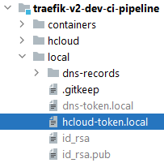
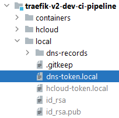

# Setup for Simple Container Infrastructure

[https://github.com/mbachmann/traefik-v2-dev-ci-pipeline](https://github.com/mbachmann/traefik-v2-dev-ci-pipeline)

This repository contains a setup for a virtual machine at the hetzner cloud infrastucture 
including a docker based container infrastucture with a traefik v2 remote proxy. 

The setup of the server is done by using the hetzner hcloud-cli and cloud-init.

## Content

* [Prerequisite](#prerequisite)
* [Create a hcloud token file](#create-a-hcloud-tokenlocal-file)
* [Create a dns token file](#create-a-dns-tokenlocal-file)
* [Get the DNS ZoneID](#get-the-dns-zoneid)
* [Adjust the cloud-init.yml file](#adjust-the-hcloudcloud-inityml-file)
* [Adjust the scripts/environment.sh file for the server parameters](#adjust-the-scriptsenvironmentsh-file-for-the-server-parameters)
* [Adjust the scripts/environment.sh file for the containers](#adjust-the-scriptsenvironmentsh-file-for-the-containers)
* [Create a password for traefik login](#create-a-password-for-traefik-login)
* [Adjust the init-container.sh file](#adjust-the-init-containersh-file)
* [Create a server](#create-a-server)
* [Login to the server](#login-to-the-server)
* [Delete the server](#delete-the-server)


## Prerequisite

- bash console (windows cmd-line or PowerShell is not working). On Windows install [git bash](https://git-scm.com/downloads).
- hcloud-cli from Hetzner [hcloud](hcloud/README.md).
- A created project at the [Hetzner Cloud](https://console.hetzner.cloud/projects).
- A _HCloud token_ from the Hetzner Cloud [Hetzner Cloud](https://console.hetzner.cloud/projects).
- A _DNS token_ to automatically synchronize DNS records with the [Hetzner DNS Api](https://dns.hetzner.com/).
- A **fork** of this repository.
**Go to GitHub and create a fork**. Any change of this repository requires a _commit and push_ before creating a server. This
repository is cloned into your new created server and will be used to boot the container infrastructure. It means you need _**git push**_ rights.


### Create a hcloud-token.local file

In order to access the Hetzner cloud API you need an api token. The api-token is safed in the _hcloud-token.local_ file.

- Create a file in the folder **_local_** with name _hcloud-token.local_.
- Copy the token from your project in  [Hetzner Cloud Console](https://console.hetzner.cloud/projects) to the file  _hcloud-token.local_.



### Create a dns-token.local file

If you want automatically update the DNS records, you can use the Hetzner DNS Api.

- Create a file in the folder **_local_** with name _dns-token.local_
- Copy the token from your project in  [Hetzner DNS Console](https://dns.hetzner.com/settings/api-token) to the file  _dns-token.local_.
You can create a new access token and copy it to the file. The Hetzner CNS Console allows you to [add a new zone](https://dns.hetzner.com/add-zone) which has been 
registered at another registrar **without** transfering the dns-registration to Hetzner.



### Get the DNS ZoneID

In order to access the dns api for the desired zone we need the ZoneID. 

- Go to the [Hetzner DNS Console](https://dns.hetzner.com/settings/api-token) and click on the desired zone.
- The ZoneId is visible the browser url. Copy the ZoneID to the file _scripts/environment.sh_.


Adjust the environment variables in the file _scripts/environment.sh_.

```shell
export USE_HETZNER_DNS_API="true"
export DOMAIN_URL="sintares.com"
# recover zone id with getzones, defined in dns.sh
export ZONE_ID="aUypFiQLNDVPCUA3GJ8MLJ"
```

### Adjust the hcloud/cloud-init.yml file

The file _hcloud/cloud-init.yml_ is used to set up _Ubuntu_. The file cloud-init.yml controls how the server will get created. Following adjustments are important:

1. Delete the entries in ```ssh_authorized_keys:```.

```yaml
  ssh_authorized_keys:
  - ssh-rsa AAAAB3NzaC1yc2EAAAADAQABAAABgQC3qXq80S4wl5dpFtHoGpEe0LERxaVgZimejhdbatE3FFodG33V2UgErkhdKogdqa5SwzKITOgUYVVingOUkocqn4U9kGN2HvtaWf6iyROi4bC+NiqYfYkHRt1ETQtWxDWtH5Bp4UlvdB6TNJuZAFNGRaeOiv79UNK7P7SClXFZ/w0lKGxwt30hZDT73rKjUnm/f09KcAmurM4YHPDqV70dKcGdR5pAoCxSvWvYjf9cc1Jy8jZAR4wt/kFBuu2F6YFpTn0ygY6Kg/1DufD7ggERqNGzKvbKvxNBmck7qxxTBGxZ7baqkrLBMkmZ2RvTjlnyE9jw9WrzebfHEFirwqJMtX8gPl7lpvkKvtykPQq/tXk2LZi+ycHRDeohLWrz5TIZ8Xjc8fnxuxiWuyvmHJrVjW5LkU6SjPoakzXNXTDlgN7Fde/N4A8uX6k7JUB9dA2jGJ/WyilDU6NeniDFDLqI2rX75UB2cb4KIPkEIGzIpK6AE6opwIlkAlNqGRByyMs= mbach@s001
  - ssh-rsa AAAAB3NzaC1yc2EAAAADAQABAAABgQCrscyixoq3xozuTYn0G3GNADNLnSaOAmkzC2ltiEvB6SNDGpTrYi/BstnexmfIqYwwaOMIgivhebYGgHlyTxn9WFS2060om7jsz8DnZKMpWLTLHQ4gC0IjnUJCb53NUCmo5/2KupM8bSWrZgupN65nvjr8LkYC5tZBqWKDuNo4YcSpfQwK0GGpVIW7rRV6zbl6EDIxGJbaWpDlY9Zy8hgVoBlfROJfHNCP7DMEosVsWC5RTLV+GfeboDS++JLjP6BEeDmk1FCLcZzybjQ4On80fzy2Vn1DQPpWIde5c1tgzGzDOD2NoluTmexkqBt24QmXL2W9406+QaNHcT0+Yb2Kleu2MSpp+NfIN0DPwbItNg9uk0p1TzWRDV2QTyxV4lMN9VeNOjN48YOi1K4/wX8u/0IikolqdMhmYC7JLst+Bxrp2VriZY2v5TV/3iEdtpn1DKWdvwHzfwpPEmzv0OWLSNBURa7EZtU3Hzu5u/veR0MTJzfGR3wOqEhvxcJlAb8= mbach@s001
  - ssh-rsa AAAAB3NzaC1yc2EAAAADAQABAAABgQDBv0l4kD0nT1At+90mbv7Q8v/Z73swmHCyuKoafBJ/BNNoWXxPcQpI5C7/YPFDvIoXEUJQFRnvFSXiLKwjiAeWzlddWIprWq77PmybqmWC99uIToXrJ+5o4fteWi7cy6rhN1gfROgP6hSX3pwj59sF1LzomHHIQd1+vU3+xEwNVstGZnOOSr5sKUCvGhvHbyPMgpOaUOqjTaDoJz29wXI62NKgz0D2f2uMSsIwU6npXxQMSZMohGOjvFmaTNQx0b+NVzNxnB3DvIH1Rb/+0W1OxcWq0OkBU8mq4TslMPmaF0Y3AcSlhVm4zU6T/UdzSVfOsN4yEu+i+D02AuBhs4Ks8aOPlut7WTn5kCF82JOsJe6jsuZP7iaGagRhaar3+KilTkVfr1GgaMpnEXAX+kXiOUsTRqaiDRausUjq4sQPd7lvr0WtjcYxZF1yV0sohCTt9crL2lTmmF9Q3yEw6mT9ok7EJn3wRaSpnE904NwIbR1ffrRWIojVm6blSBoEfEM= mbach@itbmba14

```

Each entry represents a public key which can be used to login with ssh to the server. The _createServer script_ will automatically add the
public key from the file _local/id_rsa.pub_ to cloud-init.yml. If the key does not exist, it will be created automatically and registered through the api at Hetzner.

2. Add your **forked repository url** to the file _hcloud/cloud-init.yml_.

```yaml
  - git clone https://github.com/mbachmann/traefik-v2-dev-ci-pipeline /home/ubuntu/traefik-v2-dev-ci-pipeline
```

Replace the url _https://github.com/mbachmann/traefik-v2-dev-ci-pipeline_ with your own url.

3. Check the installed the packages

Depending on the requirements you can choose if webmin or postgres shall be installed. Just delete the lines in  _hcloud/cloud-init.yml_ packages section.

- webmin
- postgresql
- postgresql-contrib


4. Check the runcmd part

If you do not want installing the mysql server on localhost the commands can be deleted:

- echo "mysql-server mysql-server/root_password password pwd" | sudo debconf-set-selections
- echo "mysql-server mysql-server/root_password_again password pwd" | sudo debconf-set-selections
- sudo apt-get -y install mysql-server


### Adjust the scripts/environment.sh file for the server parameters

The parameter for the server can be adjusted in the file _scripts/environment.sh_.

1. Project name as defined in https://console.hetzner.cloud/projects.

```shell
export HCLOUD_PROJECT_NAME="cas-oop"
```

2. Arbitrary user name

```shell
export HCLOUD_USER_NAME="mbach"
```

3. Arbitrary server name

```shell
export SERVER_NUMBER="11"
export SERVER_NAME="s${SERVER_NUMBER}"
```

4. Server type as in https://www.hetzner.com/cloud

| ID  | NAME | CORES | CPU TYPE  | MEMORY  | DISK   | STORAGE TYPE |
|-----|------|-------|-----------|---------|--------|----------|
| 1   | cx11 | 1     | shared    | 2.0 GB  | 20 GB  | local    |
| 3   | cx21 | 2     | shared    | 4.0 GB  | 40 GB  | local    |
| 5   | cx31 | 2     | shared    | 8.0 GB  | 80 GB  | local    |
| .   | ...  | .     | ..        | ..      | ..     | ..       |
| 11  | ccx11 | 2    | dedicated | 8.0 GB  | 80 GB  | local    |
| 12  | ccx21 | 2    | dedicated | 16.0 GB | 160 GB | local    |
| .   | ...  | .     | ..        | ..      | ..     | ..       |

```shell
export SERVER_TYPE="cx11"
```

For services like webmin, lokal databases and several containers use _cx21_.

5. Server image as in https://console.hetzner.cloud/projects/1414551/servers/create 

Can be one of the images: centos-7, centos-stream-8, centos-stream-9, ubuntu-18.04, ubuntu-20.04, 
ubuntu-22.04, debian-10, debian-11, fedora-35, fedora-36. There are also predefined app images 
available like ruby, go, gitlab, docker-ce, lamp, nextcloud.

```shell
export SERVER_IMAGE="ubuntu-20.04"
```

Currently, only the image _ubuntu-20.04_ has been tested.

6. Server Location 

The current list of server locations can be retrieved with _hcloud location list_

| ID  | NAME | DESCRIPTION           | NETWORK ZONE | COUNTRY | CITY        |
|-----|------|-----------------------|--------------|---------|-------------|
| 1   | fsn1 | Falkenstein DC Park 1 | eu-central   | DE      | Falkenstein |
| 2   | nbg1 | Nuremberg DC Park 1   | eu-central   | DE      | Nuremberg   |
| 3   | hel1 | Helsinki DC Park 1    | eu-central   | FI      | Helsinki    |
| 4   | ash  | Ashburn, VA           | us-east      | US      | Ashburn, VA |

```shell
export SERVER_LOCATION="hel1"
```
7. During server setup, this repo is cloned -> change it to your forked repository.

```shell
export GIT_REPO=https://github.com/mbachmann/traefik-v2-dev-ci-pipeline
```

8. Create and attach an external volume

The server can be created with an external volume attached. In this case the container
persited volume is on this external volume. in case of server delete and recreate, the
data is saved on the external volume and gets not destroyed.

```shell
export USE_VOLUME="true"
```

- If USE_VOLUME is false then the persitent volume is in **/home/ubuntu/data**.
- If USE_VOLUME is true then the persitent volume is in **/mnt/storage1**.

### Adjust the scripts/environment.sh file for the containers

1. Suddomain: A sub domain can be defined to allow same services with same domain on several servers. 
In this example, the server name is part of the url.

```shell
export SUB_DOMAIN=".${SERVER_NAME}"
```

- Example with subdomain: traefik.s11.sintares.com
- Example without subdomain: traefik.sintares.com

If no subdomain is required, then SUB_DOMAIN=""


```shell
export BASE_URL="${SUB_DOMAIN}.${DOMAIN_URL}"
```

2. Service Name and URL for each service

- traefik.s11.sintares.com: Traefik Reverse Proxy
- portainer.s11.sintares.com: Container management

```shell
# Service Names
export TRAEFIK_SVC="traefik${SUB_DOMAIN}"
export PORTAINER_SVC="portainer${SUB_DOMAIN}"
# export PORTAINER_EDGE_SVC="edge${SUB_DOMAIN}"

export BLOG_SVC="blog${SUB_DOMAIN}"
export ADMINER_SVC="adminer${SUB_DOMAIN}"
export TODO_H2_SVC="todo-h2${SUB_DOMAIN}"
export TODO_MYSQL_SVC="todo-mysql${SUB_DOMAIN}"
```

```shell
# URL's for installed applications
export TRAEFIK_URL="${TRAEFIK_SVC}.${DOMAIN_URL}"
export PORTAINER_URL="${PORTAINER_SVC}.${DOMAIN_URL}"
export PORTAINER_EDGE_URL="${PORTAINER_EDGE_SVC}.${DOMAIN_URL}"

export BLOG_URL="${BLOG_SVC}.${DOMAIN_URL}"
export ADMINER_URL="${ADMINER_SVC}.${DOMAIN_URL}"
export TODO_H2_URL="${TODO_H2_SVC}.${DOMAIN_URL}"
export TODO_MYSQL_URL="${TODO_MYSQL_SVC}.${DOMAIN_URL}"
```

## Create a password for traefik login

You can create the password for the traefik login with the help of the page: [https://htpasswdgenerator.de/](https://htpasswdgenerator.de/)

- Username: admin
- Password: <desired password>

After clicking to [Generate] you can copy the password like : 

``admin: $apr1$ugtkwsey$DKYix37/PkhQSN4xk/xHj0``

to the file traefik/traefik_dynamic.toml.

```toml
[http.middlewares.simpleAuth.basicAuth]
  users = [
    "admin: $apr1$ugtkwsey$DKYix37/PkhQSN4xk/xHj0"
  ]

```

Another option to create the file is with htpasswd (if available):

```shell
htpasswd -nb admin password
```

## Adjust the init-server.sh file

The file init-server.sh is configuring the server after boot. It configures webmin and the local databases. 
at the end it calls the script file init-containers.sh.

## Adjust the init-containers.sh file

The file init-containers.sh is controlling which containers are going to get automatically started.


## Create a server

After adjusting all environment variable, the server can get created. 

IMPORTANT STEPS after changig the repository:

1. **Commit and push the repository**. createServer will not continue with an uncommited repository
2. Enter in your bash command line **source cli**. The updated enviroment is available now.

```shell
source cli
createServer
```

After the script has been terminated, wait 10 seconds, and you can login to your server:

```shell
login
```

The newly created server is installing and updating during about **2 minutes**. After 2 minutes the server
is automatically rebooting. The login to the server is terminted. You need to login once more. 


#### Important commands for verifying the infrastructure:

```shell
docker ps -a
docker logs traefik
sudo cat /var/log/syslog | grep portainer
cat /var/log/cloud-init.log | grep init-container
```

Open the browser an enter: 

- https://traefik.s11.YOURDOMAIN

Login with admin and the password you have chosen for the traefik login.

## Login to the server

Simply enter login for an ssh connection.

```shell
login
```

## Delete the server

```shell
deleteServer
```

## Create a Password for Webmin login

