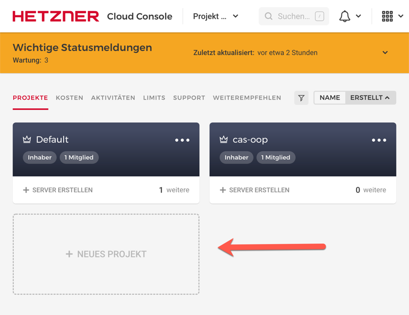
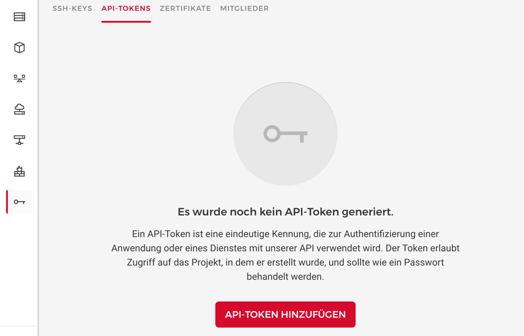
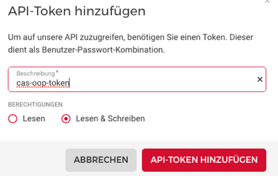
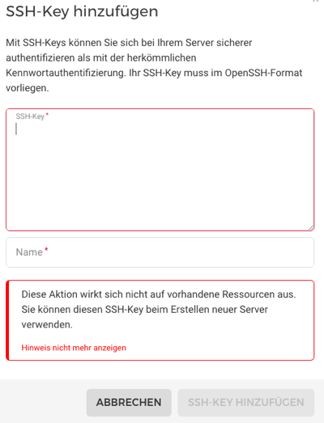

# HCloud for Hetzner Cloud

- Cloud Intro and prices: [https://www.hetzner.com/cloud](https://www.hetzner.com/cloud)
- Basics: [https://docs.hetzner.com/de/cloud ](https://docs.hetzner.com/de/cloud )
- Hetzner Cloud Libraries and Tools: [https://github.com/hetznercloud/awesome-hcloud](https://github.com/hetznercloud/awesome-hcloud)
- Hcloud cli: [https://github.com/hetznercloud/cli](https://github.com/hetznercloud/cli)
- Hcloud cli tutorial: [https://community.hetzner.com/tutorials/howto-hcloud-cli](https://community.hetzner.com/tutorials/howto-hcloud-cli)
- Cloud Login: [https://console.hetzner.cloud/projects](https://console.hetzner.cloud/projects)

## Prerequisits

- [ssh](../readme/sshkeypair/README.md) key pair (private and public key) ([Windows](https://www.howtogeek.com/762863/how-to-generate-ssh-keys-in-windows-10-and-windows-11/), [MacOS](https://www.digitalocean.com/community/tutorials/how-to-create-ssh-keys-with-openssh-on-macos-or-linux))
- A key pair ist automaticall generated by using the command createServer of this repository
- ssh - bash (MacOS or Windows) or [putty](https://www.chiark.greenend.org.uk/~sgtatham/putty/latest.html) (Windows)


## Create a project

Login to Hetzner cloud: [https://console.hetzner.cloud/projects](https://console.hetzner.cloud/projects)

Create a project and give a name to this project



### Create a token

Click on the new created project and navigate on the left toolbar to the Security tab.



<br/>



After a click on add API-TOKEN the token will be presented in a new dialog. Copy
the token and save it.

### Add ssh key

Add the public key to the dialog and give the key an arbitrary name:



## Install hcloud

You can download pre-built binaries for Linux, FreeBSD, macOS, and Windows on the releases page.

On macOS, you can install hcloud via Homebrew:

```sh
brew install hcloud
```

On Windows, go the the  [releases page](https://github.com/hetznercloud/cli/releases) and download an executable, ... or you can install hcloud via Scoop
```sh
scoop install hcloud
```

### Verify hcloud

Check hcloud version:

```shell
hcloud version
```

Check your available servers:

```shell
hcloud server list
```

## Create a context

Before you can start using the hcloud-cli you need to have a context available. A context is a specific API Token from the Hetzner Cloud Console.

```shell
hcloud context create cas-oop
```

This command will create a new context called _cas-oop_. 
After the command, you will be prompted to enter your API token. 
Keep in mind, the token is not visible while you are entering it. 
Press enter when you have entered the token. 
You should see a confirmation message _Context cas-oop created and activated_.

```shell
hcloud context list

ACTIVE   NAME
         default
*        cas-oop
```

you can change the active context by:

```shell
hcloud context use cas-oop
```


## Create a server

First of all, you need to know which server you want to create. 
You can see a list of all available server types with:

```shell
hcloud server-type list
```

The machine type cx11 is the cheapest server.

Then we need an image, which should be the base of the server. 
The Hetzner Cloud supports a various range of images. 
You can list all available images with: 

```shell
hcloud image list
```

We will use the _ubuntu-20.04_ image. The server will get the name _cas-oop-srv-01_.

```sh
hcloud server create --image ubuntu-20.04 --type cx11 --name cas-oop-srv-01 --user-data-from-file cloud-init.yml
```
You created a server called cas-oop-srv-01! 
After the creation is finished you should see a similar output like:

```sh
Waiting for server 1234 to have started... done
Server 1234 created
IPv4: <xxx.xxx.xxx.xxx>
Root password: TmRsdC3NCgHAbnf9f3rq
```

You can now connect to your server via SSH with the Root password! 
Please note, for security purposes it's always recommended to setup 
key based ssh-access.

> **Please note:** 
> The server will be installed with docker and docker-compose. 
> The installation process requires to reboot the server. 
> The server is completly ready _after about 5 - 10 minutes_. 
> You can check its readyness _after login_ by entering the command
> 
> ```shell
> docker-compose --version
> ```

### Get all details about the server

You have created a new server in the last step and now 
you want to show more details about your server? 
With _hcloud server describe_ you can see all available information about your server.


```sh
hcloud server describe cas-oop-srv-01
```

You can now see all the information about the server:

### List all servers in the context

Do you want to show which servers are in your context? 
With hcloud server list you can list all of your servers in your context. 

```sh
hcloud server list
```

You should see a similar output like below:

```sh
ID         NAME             STATUS    IPV4             IPV6                      DATACENTER
20312432   cas-oop-srv-01   running   xxx.xxx.xxx.xxx   xxxx:xxx:xxxx:xxxx::/64   hel1-dc2
```


### Delete the server

Do you want to delete your server? No problem! You can use the hcloud server delete command!

```sh
hcloud server delete cas-oop-srv-01
```

After this you will get a confirmation:

```shell
Server 20312432 deleted
```

## Login to the Server

Take the ip number you have got from creating the server. You can login with ubuntu@xxx.xxx.xxx.xxx and password.

```sh
ssh ubuntu@xxx.xxx.xxx.xxx
```

Please note, for security purposes it's always recommended to setup
key based ssh-access.

```sh
ssh -i ~/.key/hetzner ubuntu@xxx.xxx.xxx.xxx
```

At the first connect to the new server you will see the message:

```sh
The authenticity of host '65.108.209.179 (65.108.209.179)' can't be established.
ECDSA key fingerprint is SHA256:EHblnA7tE72Tjw1IxMVlji5oZhXqQ95Qvss0kAIcUNI.
Are you sure you want to continue connecting (yes/no/[fingerprint])? yes
```

You need to confirm this message with _yes_.

After that, you will see the login prompt of your new server:

```sh
...
To run a command as administrator (user "root"), use "sudo <command>".
See "man sudo_root" for details.

ubuntu@cas-oop-srv-01:~$ 
```

you can leave the server with the command _exit_.


If you get the follwing message:

```sh
@@@@@@@@@@@@@@@@@@@@@@@@@@@@@@@@@@@@@@@@@@@@@@@@@@@@@@@@@@@
@    WARNING: REMOTE HOST IDENTIFICATION HAS CHANGED!     @
@@@@@@@@@@@@@@@@@@@@@@@@@@@@@@@@@@@@@@@@@@@@@@@@@@@@@@@@@@@
IT IS POSSIBLE THAT SOMEONE IS DOING SOMETHING NASTY!
...
```

In this cas you must delete the server entry from the file ~/.ssh/known_hosts by using the command:

```sh
ssh-keygen -R "xxx.xxx.xxx.xxx"
```

## Create a volume and attach it to the server

Now we create a volume, which is a similar command to the server creation.

```shell
hcloud volume create --format ext4 --server cas-oop-srv-01 --size 10 --name storage01 --automount
```

Check the disc with:

```shell
sudo fdisk -l
```

### Detach a volume

You can now detach the volume from the server by calling.

```shell
hcloud volume detach cas-oop-vol-01
```

### Delete a volume

You can now detach the volume from the server by calling.

```shell
hcloud volume delete cas-oop-vol-01
```

# Create a ubuntu password

